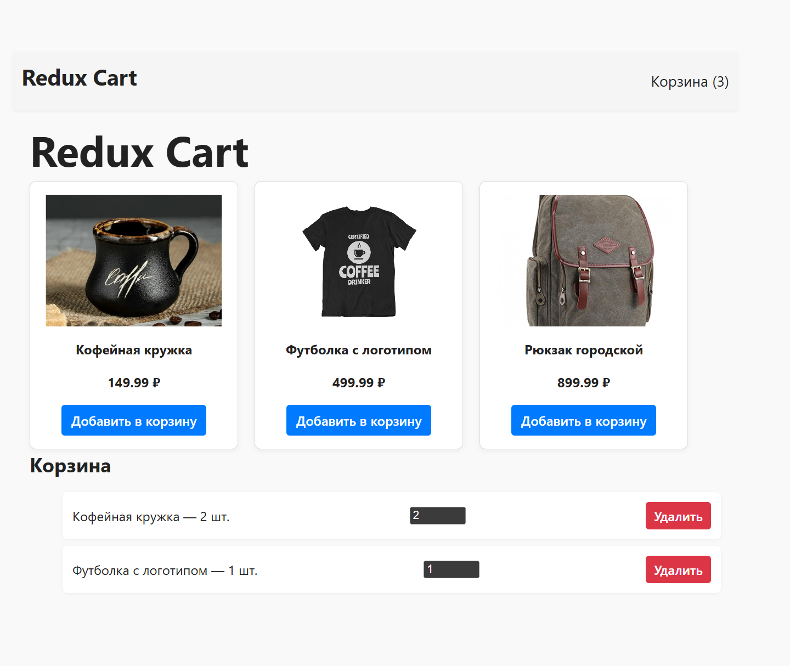

 Redux Cart — Лабораторная работа №6

## Описание
Интернет-магазин с корзиной, реализованной с помощью **Redux Toolkit** и **RTK Query**.  
Проект выполнен в рамках лабораторной работы №6 по дисциплине "Разработка веб-приложений с использованием React".

##  Цели лабораторной
- Освоить концепцию **глобального состояния** в React
- Научиться использовать **Redux Toolkit** и **RTK Query**
- Реализовать функциональность корзины: добавление, удаление, изменение количества
- Сохранять состояние в **localStorage**
- Загружать данные с сервера (**MockAPI**)

##  Стек технологий
- React
- Redux Toolkit
- RTK Query
- MockAPI
- Vite

##  Функциональность
- Загрузка товаров с MockAPI (`GET /products`)
- Добавление товара в корзину
- Удаление товара из корзины
- Изменение количества товара
- Отображение количества товаров в шапке
- Сохранение корзины в `localStorage`
- Восстановление корзины при загрузке страницы

## Структура проекта
src/
├── api/ # RTK Query API (productsApi.js)
├── components/ # Header, ProductCard, ProductList
├── pages/ # CartPage
├── store/ # Redux store и слайсы
│ ├── cart/
│ │ ├── slice.js
│ │ └── actions.js
│ └── store.js
├── App.jsx
├── main.jsx
├── index.css


##  Как запустить проект

1. Установить зависимости:
```bash
npm install
Запустить локальный сервер:

bash

npm run dev
Перейти в браузере по адресу:

arduino
http://localhost:5173
 MockAPI
Используется публичный MockAPI:
https://6848a7afec44b9f3494193f5.mockapi.io/products

 Скриншот интерфейса



✅ Выполненные задания
 Настройка Redux Toolkit Store

 Создание слайса cart

 Компонент CartPage

 Использование селекторов через actions.js

 Отображение количества товаров в шапке

 Сохранение состояния корзины в localStorage

 Загрузка товаров с сервера через RTK Query